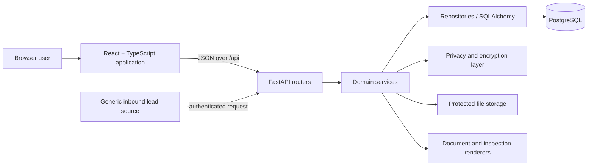

# Automotive Service CRM

Automotive Service CRM is a sanitized portfolio mirror of a private commercial CRM project.  
The primary development history remains private because it contains production-specific configuration, operational history and sensitive artifacts.

## About the project

The system supports the day-to-day workflow of an automotive detailing and service business: registering clients and vehicles, planning work, calculating an order, recording payments and expenses, documenting vehicle condition, producing customer documents, and reviewing operational analytics.

This is intentionally a substantial source snapshot rather than a simplified CRUD demo. The public copy preserves the application's real layering, domain workflows, migrations, permission checks, privacy controls, and automated tests while removing private business data and infrastructure.

## Why this repository exists

The public repository was created as a separate, allowlisted export. The private repository's `.git` directory was not copied, and this repository starts with a new history. Runtime storage, customer media, generated documents, database exports, private deployment material, internal runbooks, proprietary templates, branding, fonts, and unverified third-party datasets are excluded.

That separation is deliberate: a clean current tree does not make historical artifacts or operational metadata safe to publish.

## Product capabilities

- order lifecycle management with services, calculations, status history, payments, materials, notes, reminders, photos, and custom fields;
- client and vehicle records, including normalized search and vehicle ownership history;
- inspection sessions and a canvas-based damage/condition workflow;
- live document records plus DOCX/PDF rendering and protected file-storage code;
- finance categories, expenses, attachments, payment reconciliation, and analytics views;
- users, device/refresh sessions, route guards, role-based defaults, and per-user permission overrides;
- internal notifications and reminder workflows;
- generic protected inbound lead ingestion with source credentials, rate limits, validation, and duplicate handling;
- settings, service catalog, vehicle brand/model lookup, and catalog synchronization boundaries.

These capabilities describe code present in this snapshot. They are not a claim that every deployment concern is included or that the snapshot is ready to operate as a hosted product.

## Product preview

> All screenshots below were captured from a staging environment populated exclusively with generated synthetic data. They contain no production or customer records.

### Analytics

Financial and operational metrics with profitability and period analysis.


### Orders

Order workflow with status filters, search, scheduling, and payment state.


### Calendar

Service scheduling, deadlines, reminders, and category-aware calendar planning.


### Vehicles

Vehicle registry with VIN/model search and customer-related records.


### Clients

Customer directory with contact search and related service information.


## Architecture



The active UI is web-first. React Query handles server state, React Router v6 defines navigation and access boundaries, and feature modules own their forms, views, and API bindings. FastAPI exposes a modular API and delegates business behavior to services and repositories. PostgreSQL is the only supported database path; Alembic records schema evolution.

More detail is available in [the architecture overview](docs/architecture/overview.md).

## Backend design

The backend separates transport schemas, API routers, domain services, and persistence repositories. Cross-cutting modules cover typed application errors, request context, cache control, client-IP handling, security, structured logging, time handling, cryptography, and privacy-aware field projection.

Authentication uses short-lived access tokens plus server-side refresh/device sessions. Runtime policy checks reject unsafe production-like defaults. Permissions are enforced in API dependencies and, for sensitive order transitions, again in service logic. Personal-data services centralize encrypted values, keyed search hashes/blind indexes, masking, and privilege-sensitive projection. File services keep attachment and document access behind application authorization rather than exposing storage paths directly.

## Frontend design

The frontend is organized by business feature (`orders`, `clients`, `vehicles`, `inspection`, `documents`, `finance`, `analytics`, `users`, and others), with shared UI, configuration, query infrastructure, and an application shell. It uses React Hook Form and Zod for input flows, TanStack Query for remote state, Zustand for focused client state, ECharts for analytics, and Konva/React Konva for inspection graphics.

React Router v6 route metadata and guards coordinate authentication and permission-aware navigation. Responsive layouts are designed for the active web workflow; the historical native packaging layer is intentionally not included in this portfolio snapshot.

## Data model and migrations

SQLAlchemy 2.x models cover CRM users and sessions, clients, vehicles and ownership history, orders and their status/payment/service relations, materials and expenses, documents, inspections, reminders, audit records, settings, catalog entities, and protected inbound leads. Alembic migrations are included through the snapshot's single current head and show how privacy indexes, session controls, payment stabilization, attachments, and vehicle history evolved.

Migrations are source evidence only in this repository. Review them against a disposable local PostgreSQL instance before applying them; SQLite is not supported.

## Security and privacy

Implemented controls include password hashing, signed access tokens, refresh/device session persistence and revocation, login/refresh throttling, permission dependencies, production-like configuration validation, field encryption, keyed search hashes/blind indexes, privacy-aware response projection, encrypted file handling, safe path resolution, and selected audit records.

These mechanisms reduce risk but do not constitute a security certification. Deployment controls, secret management, network policy, backups, monitoring, vulnerability management, and independent review remain the operator's responsibility. The included `.env.example` contains names and placeholders only.

## Notable engineering challenges

1. **Searchable protected data.** Personal values can be encrypted while normalized keyed hashes support exact and fragment-aware lookup without storing plaintext search columns.
2. **Vehicle ownership history.** Current vehicle/client relations coexist with an append-oriented ownership ledger and migration/backfill logic.
3. **Complex order workflows.** Calculations, services, payments, materials, status history, permissions, and archival behavior are coordinated across transactional services.
4. **Document generation.** Mapping, DOCX rendering, PDF conversion boundaries, live document records, and protected storage are separated so templates and binaries remain deployment inputs.
5. **Inspection canvas.** Structured marks and sessions are rendered through both interactive Konva UI and backend image/document composition code.
6. **Protected file handling.** Order photos and finance/material attachments combine authorization, path containment, encryption metadata, and controlled response behavior.
7. **Analytics over operational data.** Dedicated query/service paths aggregate order and finance data without turning the frontend into a reporting database client.
8. **Long-lived schema evolution.** Alembic revisions preserve incremental contracts across auth hardening, privacy changes, document behavior, payment stabilization, and vehicle search/history.

## Testing

The repository includes backend tests for auth/session policy, privacy and encryption search, API/domain behavior, migrations, documents, analytics, payments, vehicle ownership, external leads, and PostgreSQL search semantics. Frontend tests cover feature behavior, routing/permissions, forms, state handling, UI contracts, and UTF-8 safeguards; Playwright configuration is also included.

The verified portfolio snapshot reports:

- Frontend: 49 test files / 165 tests passed.
- Frontend type checking: passed.
- Frontend production build: passed.
- Backend: 296 tests collected; 47-test safe unit subset passed.
- Alembic: one migration head.

Not verified in this local-only preparation: PostgreSQL-backed integration suite, browser E2E, live migration rehearsal, and staging/production runtime. A test suite's presence is not a claim that it passes in every environment.

## Demo and screenshots

No screenshot or media file from the commercial runtime was transferred. The small fixture in `demo/fixtures/` is hand-authored and synthetic; it is an import/documentation example rather than a production-derived seed.

Portfolio screenshots can be added later only after running the application with a dedicated synthetic database and reviewing every visible name, contact detail, vehicle identifier, order note, document, and image. Until that review exists, the repository intentionally contains no product screenshots.

## Local development

Prerequisites: Python compatible with the pinned backend requirements, Node.js/npm compatible with the lockfile, and a local PostgreSQL server.

```text
1. Copy .env.example to .env and replace placeholders with unique local-only values.
2. Create a dedicated local PostgreSQL database and update DATABASE_URL.
3. Install backend requirements in a virtual environment.
4. Run the FastAPI application from backend/.
5. Install frontend packages from desktop/ and run the Vite development server.
```

Common commands after dependencies and a safe local database are available:

```bash
cd backend
uvicorn app.main:app --reload

cd desktop
npm run dev
npm run check
npm test
```

This document intentionally omits production deployment, remote hosts, backup paths, and integration credentials. Do not point the snapshot at real customer data or external integrations.

## Repository structure

```text
backend/                 FastAPI application, SQLAlchemy models, Alembic migrations, tests
desktop/                 React/TypeScript web application and frontend tests
docs/architecture/       Current-state implementation notes
docs/decisions/          Public-safe architectural decisions
demo/fixtures/           Clearly synthetic examples and import placeholders
documents_templates/     Instructions only; no private DOCX/PDF templates
scripts/                 Safe quality and generic integration utilities
```

## Project scale

The final sanitized tree contains **396** application source files, **29** non-`__init__.py` backend API router modules, **31** SQLAlchemy model modules, **61** Alembic revisions, and **82** automated test files. These counts communicate repository scope only; they are not presented as a quality metric.

## Current limitations

- The current runtime is predominantly a single-instance, single-tenant application. This snapshot does not claim complete tenant isolation, resale readiness, or multi-tenant behavior.
- It is not presented as production-ready: deployment automation, operational configuration, monitoring, backups, recovery material, and production evidence were intentionally excluded.
- API routes use the current `/api` surface; a completed general API-versioning strategy is not claimed.
- No distributable document templates, proprietary fonts, vehicle catalog dataset, customer media, or generated documents are included.
- External lead handling is a generic protected inbound boundary, not a ready-made connector to a specific website.
- Local operation requires PostgreSQL and developer-supplied secrets; some verification suites also require an isolated database or browser runtime.
- The native desktop packaging layer is outside this public snapshot; the maintained UI code shown here is the web application.

## Portfolio note and ownership

This repository is a sanitized source snapshot of a real, privately developed commercial project. The original repository, production-specific configuration, customer artifacts, and development history remain private. No open-source license is granted.

Copyright © 2026. All rights reserved.
