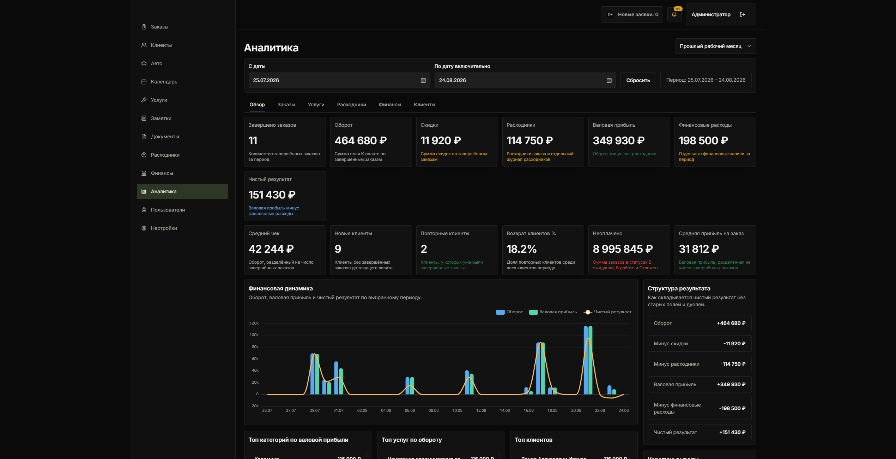
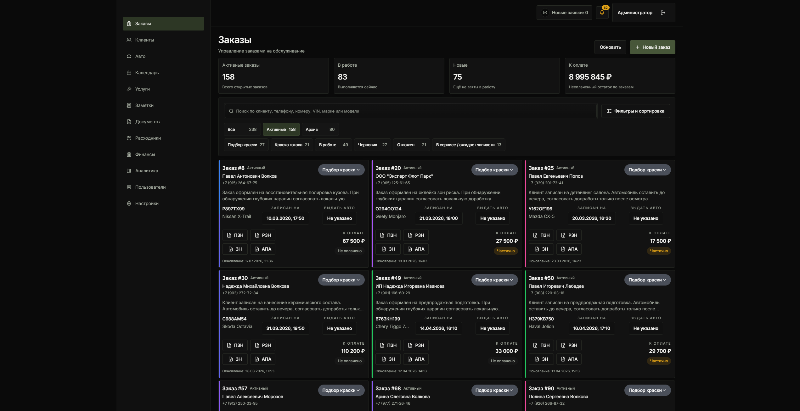
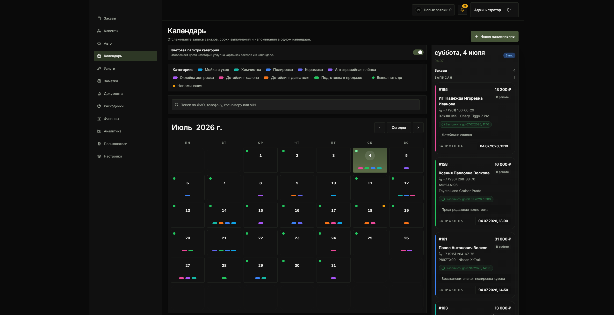
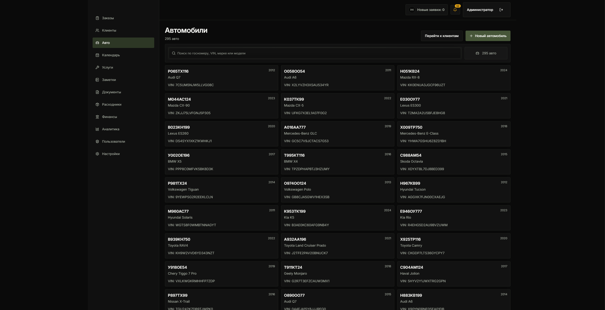
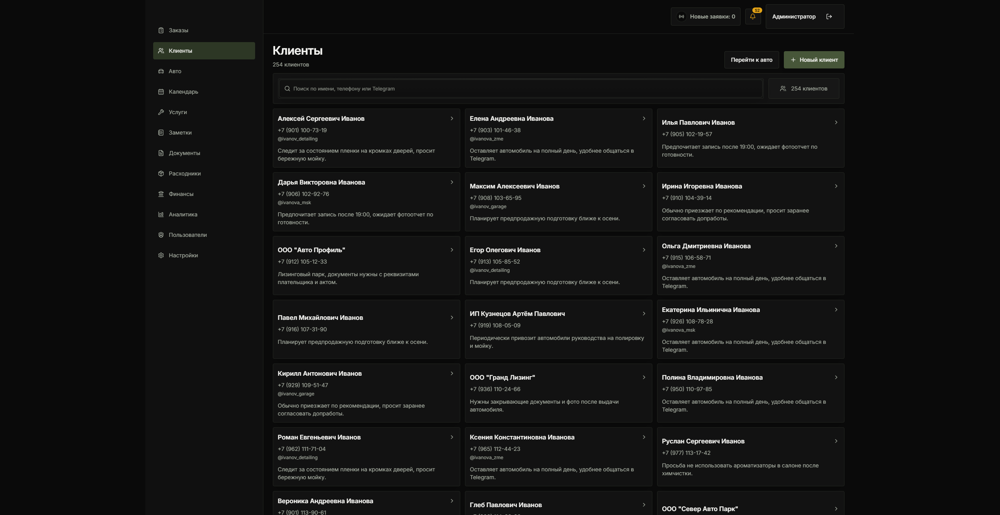
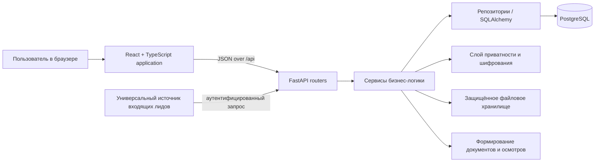

# Automotive Service CRM

[English](README.md) | [Русский](README.ru.md)

Automotive Service CRM — публичная обезличенная версия коммерческой CRM, подготовленная для портфолио.  
Основная история разработки остаётся приватной, поскольку содержит конфигурацию рабочей среды, эксплуатационные сведения и чувствительные материалы.

## О проекте

Система поддерживает ежедневные процессы студии детейлинга и автосервиса: учёт клиентов и автомобилей, планирование работ, расчёт заказов, фиксацию платежей и расходов, документирование состояния автомобиля, подготовку клиентских документов и анализ операционных показателей.

Это намеренно объёмный срез исходного кода, а не упрощённый CRUD-демо-проект. В публичной версии сохранены фактическое разделение приложения на слои, доменные сценарии, миграции, проверки прав, механизмы защиты данных и автоматизированные тесты; при этом исключены закрытые бизнес-данные и инфраструктурные сведения.

## Зачем создан этот репозиторий

Публичный репозиторий подготовлен как отдельная выгрузка по заранее утверждённому списку файлов. Каталог `.git` приватного репозитория не переносился, поэтому здесь используется новая история. Исключены рабочее файловое хранилище, клиентские медиафайлы, сгенерированные документы, экспорты баз данных, закрытые материалы по развёртыванию, внутренние инструкции по эксплуатации, проприетарные шаблоны, брендинг, шрифты и сторонние наборы данных с неподтверждённым правом распространения.

Это разделение намеренное: чистое текущее дерево файлов само по себе не делает исторические артефакты или операционные метаданные безопасными для публикации.

## Возможности продукта

- управление жизненным циклом заказа: услуги, расчёты, история статусов, платежи, материалы, заметки, напоминания, фотографии и пользовательские поля;
- карточки клиентов и автомобилей, включая нормализованный поиск и историю владения автомобилем;
- сессии осмотра и интерфейс на Canvas для фиксации повреждений и состояния;
- актуальные записи документов, формирование DOCX/PDF и код защищённого файлового хранилища;
- финансовые категории, расходы, вложения, сверка платежей и аналитические представления;
- пользователи, сессии устройств и сессии обновления токенов, защита маршрутов, ролевые значения по умолчанию и персональные переопределения разрешений;
- внутренние уведомления и сценарии напоминаний;
- универсальный защищённый приём входящих лидов с учётными данными источника, ограничением частоты запросов, валидацией и устранением дубликатов;
- настройки, каталог услуг, поиск марок/моделей автомобилей и границы синхронизации каталога.

Эти возможности описывают код, присутствующий в публичной версии. Они не означают, что включены все аспекты развёртывания или что проект готов к эксплуатации как размещаемый сервис.

## Предварительный просмотр продукта

> Все скриншоты ниже сделаны в staging-окружении, заполненном исключительно сгенерированными синтетическими данными. На них нет записей из рабочей среды или данных клиентов.

### Аналитика

Финансовые и операционные показатели с анализом прибыльности и выбранного периода.



### Заказы

Рабочее пространство заказов: статусы, фильтры, поиск, планирование и состояние оплаты.



### Календарь

Планирование работ, дедлайны, напоминания и календарь с категориями услуг.



### Автомобили

Реестр автомобилей с поиском по VIN/модели и связанными клиентскими записями.



### Клиенты

Каталог клиентов с поиском контактов и связанной сервисной информацией.



## Архитектура



Активный интерфейс ориентирован на веб. React Query управляет данными, получаемыми с сервера, React Router v6 задаёт навигацию и границы доступа, а каждый функциональный модуль содержит собственные формы, представления и API-интеграцию. FastAPI предоставляет модульный API, а бизнес-логика вынесена в сервисы и репозитории. PostgreSQL — единственный поддерживаемый путь работы с базой данных; Alembic фиксирует эволюцию схемы.

Подробнее — в [обзоре архитектуры](docs/architecture/overview.md).

## Устройство backend

Backend разделён на транспортные схемы, API-роутеры, сервисы бизнес-логики и слой работы с данными. Общие модули охватывают типизированные ошибки приложения, контекст запроса, управление кешированием, обработку IP-адреса клиента, безопасность, структурированное логирование, работу со временем, криптографию и проекцию полей с учётом приватности.

Аутентификация использует короткоживущие access tokens и серверные сессии устройств и обновления токенов. Проверки конфигурации отклоняют небезопасные настройки, похожие на рабочую среду. Разрешения проверяются через зависимости FastAPI для проверки разрешений, а для чувствительных переходов заказа — повторно в логике сервисов. Сервисы персональных данных централизуют зашифрованные значения, keyed search hashes/blind indexes, маскирование и проекцию с учётом привилегий. Файловые сервисы предоставляют доступ к вложениям и документам только после авторизации приложения, не раскрывая пути хранилища напрямую.

## Устройство frontend

Frontend организован по бизнес-функциям (`orders`, `clients`, `vehicles`, `inspection`, `documents`, `finance`, `analytics`, `users` и другим), с общими UI-компонентами, конфигурацией, инфраструктурой запросов и оболочкой приложения. Используются React Hook Form и Zod для пользовательского ввода, TanStack Query для данных с сервера, Zustand для локального состояния, ECharts для аналитики и Konva/React Konva для графики осмотров.

Метаданные маршрутов и guards в React Router v6 координируют аутентификацию и навигацию с учётом разрешений. Адаптивные макеты рассчитаны на текущий веб-сценарий; исторический слой упаковки нативного приложения намеренно не входит в публичную версию.

## Модель данных и миграции

Модели SQLAlchemy 2.x покрывают пользователей и сессии CRM, клиентов, автомобили и историю владения, заказы и связанные со статусом, платежами и услугами сущности, материалы и расходы, документы, осмотры, напоминания, журналы аудита, настройки, каталог и защищённые входящие лиды. Миграции Alembic включены до единственной текущей head-ревизии и демонстрируют развитие индексов для приватного поиска, контроля сессий, стабилизации платежей, вложений и истории автомобилей.

Миграции в этом репозитории — только свидетельство исходного кода. Перед применением проверяйте их на изолированном локальном экземпляре PostgreSQL; SQLite не поддерживается.

## Безопасность и приватность

Реализованные механизмы включают хеширование паролей, подписанные access tokens, хранение и отзыв refresh/device-сессий, ограничение частоты входа и обновления токена, зависимости для проверки разрешений, проверку конфигурации, похожей на production, шифрование полей, keyed search hashes/blind indexes, проекцию ответов с учётом приватности, обработку зашифрованных файлов, безопасное разрешение путей и отдельные журналы аудита.

Эти механизмы снижают риски, но не являются сертификатом безопасности. Меры безопасности при развёртывании, управление секретами, сетевая политика, резервное копирование, мониторинг, управление уязвимостями и независимая проверка остаются зоной ответственности оператора. Включённый `.env.example` содержит только имена переменных и заполнители.

## Примечательные инженерные задачи

1. **Поиск по защищённым данным.** Персональные значения могут храниться зашифрованными, а нормализованные keyed hashes поддерживают точный и поиск по фрагментам без plaintext search columns.
2. **История владения автомобилем.** Текущие связи автомобиля и клиента сосуществуют с журнальной моделью истории владения и логикой миграции/дозаполнения данных.
3. **Сложные сценарии заказов.** Расчёты, услуги, платежи, материалы, история статусов, разрешения и архивирование координируются транзакционными сервисами.
4. **Генерация документов.** Преобразование данных, рендеринг DOCX, границы PDF-конвертации, актуальные записи документов и защищённое хранилище разделены, чтобы шаблоны и бинарные файлы оставались входными данными развёртывания.
5. **Canvas осмотра.** Структурированные отметки и сессии отображаются как в интерактивном интерфейсе Konva, так и в backend-коде компоновки изображений и документов.
6. **Защищённая работа с файлами.** Фотографии заказа и финансовые/материальные вложения сочетают авторизацию, ограничение путей, метаданные шифрования и контролируемую выдачу ответа.
7. **Аналитика поверх операционных данных.** Выделенные пути запросов и сервисы агрегируют данные заказов и финансов, не превращая frontend в клиента базы данных для отчётности.
8. **Долгая эволюция схемы.** Ревизии Alembic сохраняют последовательные контракты при усилении аутентификации, изменениях защиты данных, поведении документов, стабилизации платежей и поиске/истории автомобилей.

## Тестирование

Репозиторий включает backend-тесты для политик аутентификации и сессий, поиска с учётом приватности и шифрования, поведения API и доменной логики, миграций, документов, аналитики, платежей, истории владения, внешних лидов и семантики поиска PostgreSQL. Frontend-тесты покрывают поведение функций, маршрутизацию и разрешения, формы, управление состоянием, UI-контракты и защиту UTF-8; также включена конфигурация Playwright.

Для этой публичной версии выполнены следующие проверки:

- Frontend: пройдено 165 тестов в 49 test-файлах.
- Проверка типов frontend: пройдена.
- Production build frontend: успешно собран.
- Backend: обнаружено 296 тестов; безопасный unit-набор из 47 тестов пройден.
- Alembic: одна текущая head-ревизия.

В рамках этой локальной подготовки не проверялись: интеграционный набор с PostgreSQL, browser E2E, репетиция миграции на реальной базе и работа в staging/production. Наличие тестового набора не означает, что он проходит в любой среде.

## Демо-данные

Тестовый пример в `demo/fixtures/` создан вручную и содержит синтетические данные. Он предназначен как пример для импорта и документации и не основан на данных из рабочей среды.

Скриншоты выше сделаны в staging-окружении, заполненном исключительно сгенерированными синтетическими записями.

## Локальная разработка

Требования: Python, совместимый с закреплёнными требованиями backend, Node.js/npm, совместимый с lockfile, и локальный сервер PostgreSQL.

```text
1. Скопируйте .env.example в .env и замените заполнители уникальными значениями только для локальной среды.
2. Создайте выделенную локальную базу PostgreSQL и обновите DATABASE_URL.
3. Установите зависимости backend в виртуальное окружение.
4. Запустите FastAPI-приложение из backend/.
5. Установите пакеты frontend из desktop/ и запустите сервер разработки Vite.
```

После установки зависимостей и подготовки безопасной локальной базы доступны обычные команды:

```bash
cd backend
uvicorn app.main:app --reload

cd desktop
npm run dev
npm run check
npm test
```

В этом документе намеренно отсутствуют сведения о развёртывании в рабочей среде, удалённых хостах, путях резервного копирования и учётных данных интеграций. Не подключайте публичную версию к реальным клиентским данным или внешним интеграциям.

## Структура репозитория

```text
backend/                 FastAPI-приложение, модели SQLAlchemy, миграции Alembic, тесты
desktop/                 React/TypeScript веб-приложение и frontend-тесты
docs/architecture/       Заметки об актуальной реализации
docs/decisions/          Безопасные для публикации архитектурные решения
demo/fixtures/           Явно синтетические примеры и заполнители для импорта
documents_templates/     Только инструкции; без закрытых DOCX/PDF-шаблонов
scripts/                 Безопасные утилиты качества и универсальные утилиты интеграции
```

## Масштаб проекта

Финальное обезличенное дерево содержит **396** файлов исходного кода приложения, **29** модулей API-роутеров backend без `__init__.py`, **31** модуль моделей SQLAlchemy, **61** ревизию Alembic и **82** файла автоматизированных тестов. Эти числа описывают только масштаб репозитория, а не являются показателем качества.

## Текущие ограничения

- Текущая кодовая модель преимущественно рассчитана на отдельный экземпляр системы для одной организации (single-tenant). Эта публичная версия не заявляет полноценную изоляцию tenants, готовность к перепродаже или multi-tenant архитектуру.
- Проект не заявляется как production-ready: инфраструктура для эксплуатации, автоматизация развёртывания, операционная конфигурация, мониторинг, резервное копирование, материалы по восстановлению и подтверждения работы в production намеренно не входят в публичный репозиторий.
- API-роуты используют текущую поверхность `/api`; завершённая общая стратегия версионирования API не заявляется.
- В состав не входят распространяемые шаблоны документов, проприетарные шрифты, набор данных каталога автомобилей, клиентские медиафайлы или сгенерированные документы.
- Обработка внешних лидов — это универсальная защищённая входящая граница, а не готовый коннектор конкретного сайта.
- Для локальной работы требуются PostgreSQL и секреты, предоставленные разработчиком; для части наборов проверок также нужны изолированная база или браузерная среда выполнения.
- Слой упаковки нативного desktop-приложения находится за пределами публичной версии; поддерживаемый UI-код в репозитории — веб-приложение.

## Версия для портфолио и права

Этот репозиторий — публичная обезличенная версия реального коммерческого проекта с закрытым основным репозиторием. Конфигурация рабочей среды, клиентские материалы и история разработки остаются приватными. Лицензия с открытым исходным кодом не предоставляется.

Copyright © 2026. Все права защищены.
